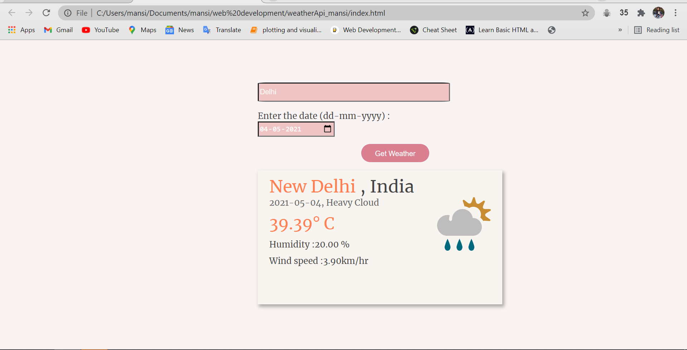

#Weather API
## Table of contents

- [Overview](#overview)
- [Screenshot](#screenshot)
- [Links](#links)
- [My process](#my-process)
- [Built with](#built-with)
- [What I learned](#what-i-learned)
- [Continued development](#continued-development)
- [Useful resources](#useful-resources)
- [Author](#author)

## Overview
Built Weather API 

### Screenshot



### Links

- Solution URL: [https://github.com/mansi05041/weather_api.github.io]
- Live Site URL: [https://weather-gilt.vercel.app/]

## My process

I have use API to fetch city name , country name , date & give output : Temperature , Humidity , wind speed and  Weather state .

### Built with

- Semantic HTML5 markup
- CSS custom properties
- Javascript
- API

### What I learned

```js
{
 fetch("https://meta-weather.vercel.app/api/location/search/?query="+ city_input)
    .then(function weather(data) {
      return data.json();
    })
}
```
I learned how to fetch elements from API using fetch() function 


### Continued development

It is not responsive . updates will reflect soon

### Useful resources

- [Meta-weather](https://meta-weather.vercel.app/) - It is helpful for implementation of API


## Author

- Frontend Mentor - [@mansi05041](https://www.frontendmentor.io/profile/mansi05041)
- Linkedin - [mansi joshi](https://www.linkedin.com/in/mansi-joshi-663aa81a0/)


